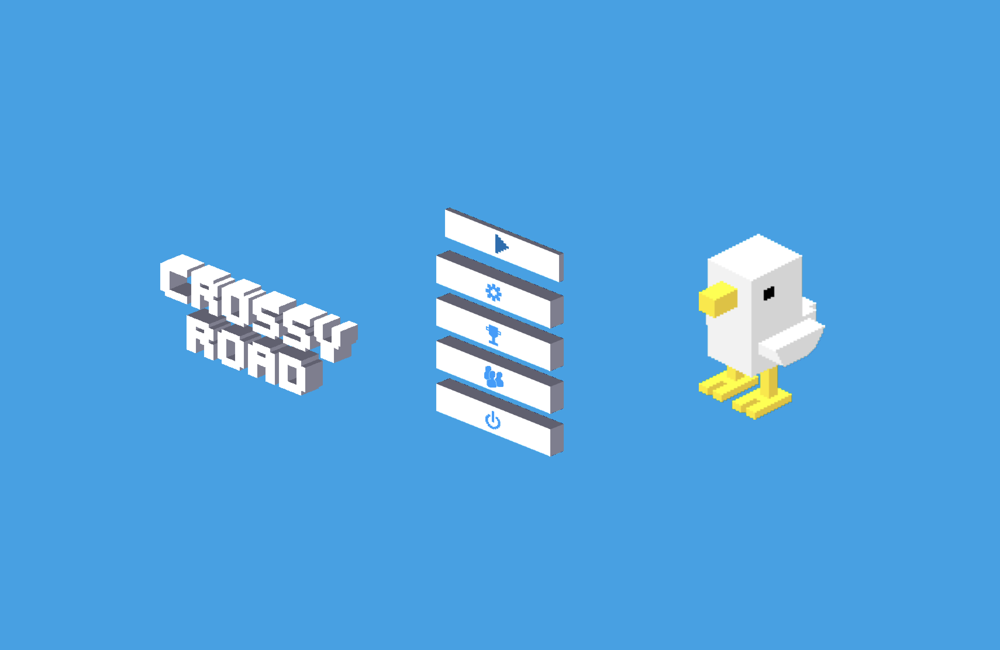
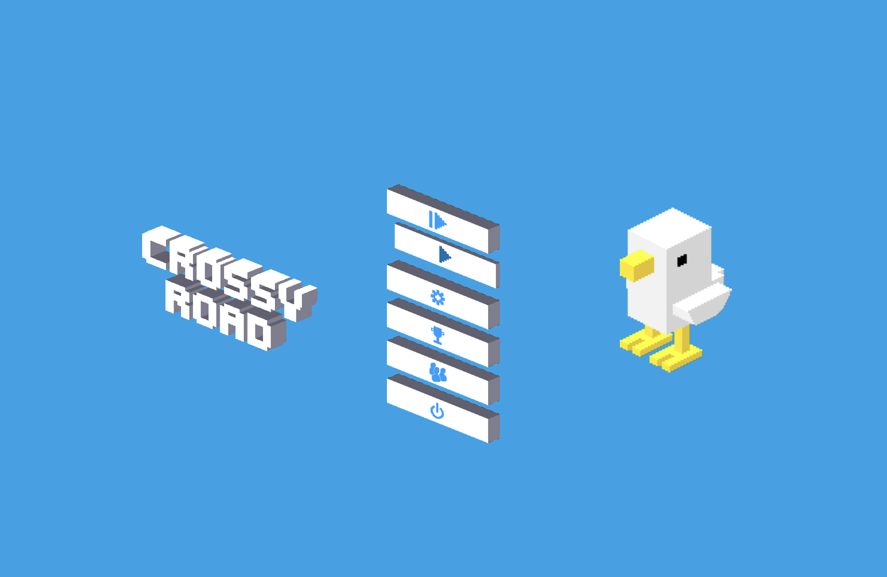
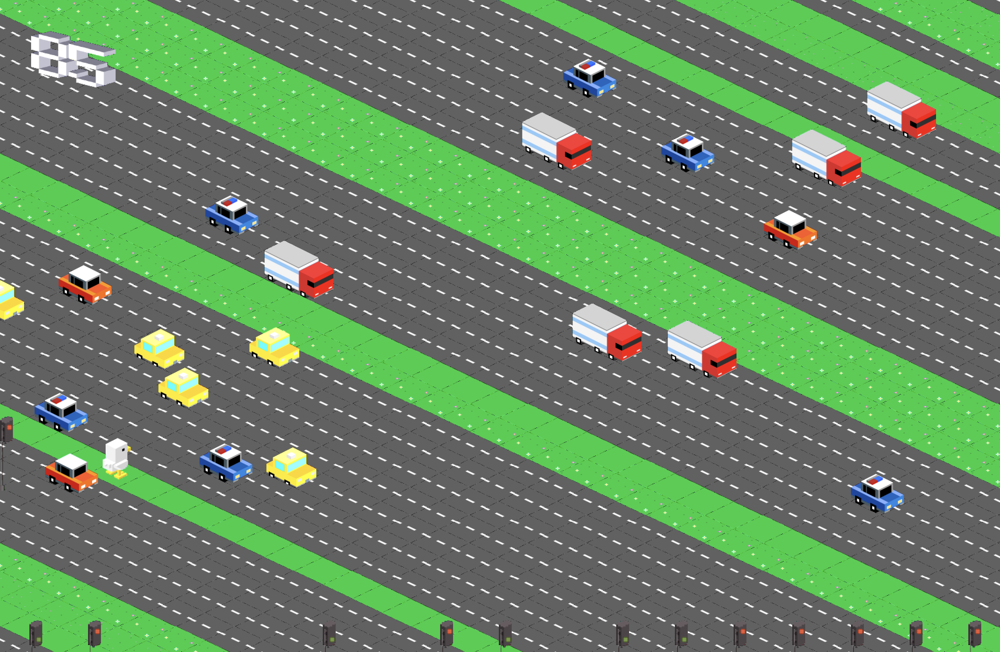
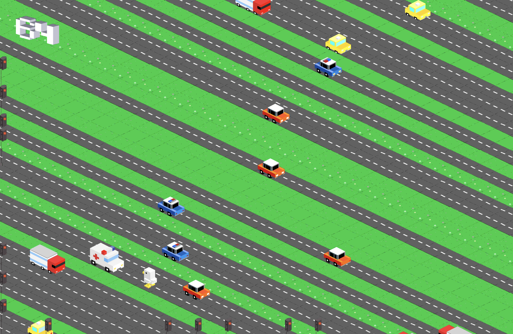
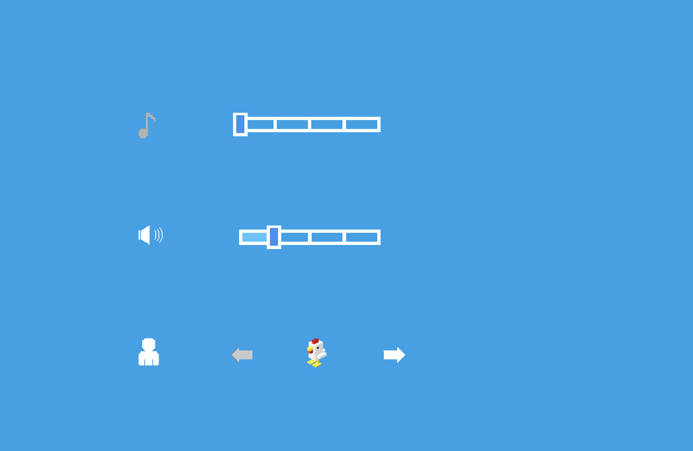
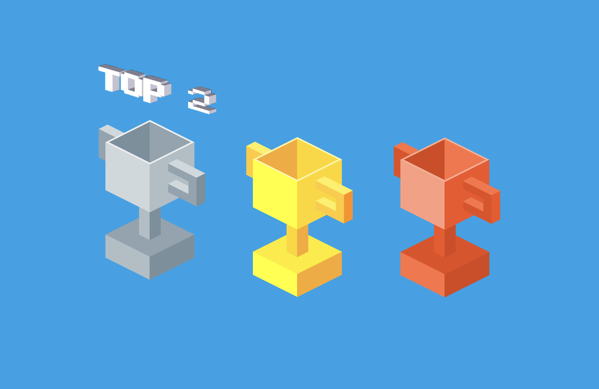
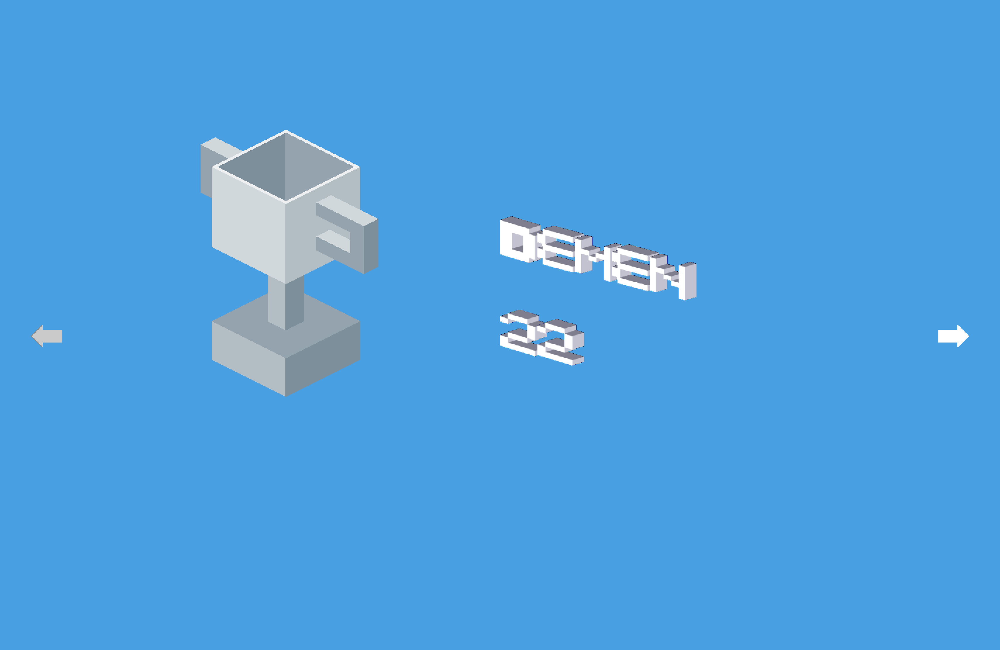
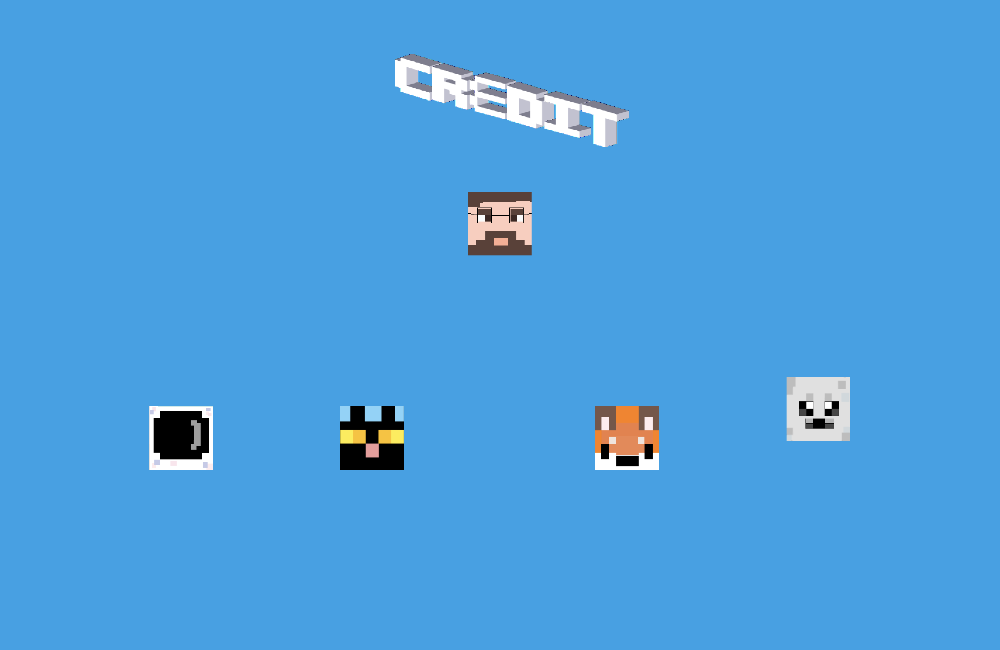
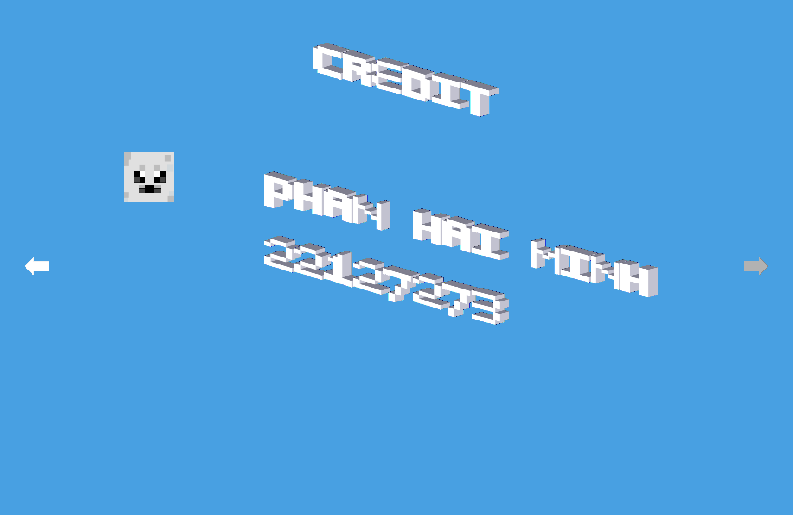

# CSC10003 Project Documentation - Group 01

## Group members

- Phan Hải Minh - 22127273
- Bùi Tá Phát - 22127320
- Đặng Thanh Tú - 22127432
- Nguyễn Ngọc Anh Tú - 22127433

## Table of contents

- [I. Overview](#i-overview)
  - [Introduction](#introduction)
  - [Gameplay](#gameplay)
   	- [Menu](#menu)
   	- [Play](#play)
   	- [Setting](#setting)
   	- [Leaderboard](#leaderboard)
   	- [Credit](#credit)

- [II. Technical details](#ii-technical-details)
  - [Code details](#code-details)
   	- [Game internal structures](#game-internal-structures)
   	- [Game objects](#game-objects)
   	- [Game scenes](#game-scenes)
  - [Game saving](#game-saving)

<div style="page-break-after: always;"></div>

# I. Overview

This section overviews the gameplay, as well as notable features of the game.

## Introduction

The game is about us, the character, who wants to cross roads and rivers to get to the grocery store but was intervened by the neverending traffic. We, the player, have to get our character safely to the other side, and we gain points as we progress through the roads. The player can use buttons from their keyboard to control the character, and the game is over once the character got hit by an obstacle. User can interact with the character or the elements on the screen using the arrow keys on the keyboard.

## Gameplay

A game demo video can be watched [here](https://www.youtube.com/watch?v=f4wmMlpRWjQ).

### Menu

With the menu screen, the player can navigate through the menu using the up and down arrow keys and choose the button using the enter key. The menu screen has several buttons: Play, Setting, Leaderboard, Credit, and Exit.

<div align="center">
 <br>
 <i>Menu screen</i>
</div><br>

If the player paused the game from the previous session, a Continue button will appear on top of the Play button.

<div align="center">
 <br>
 <i>Menu with continue screen</i>
</div><br>

### Play

The play screen is the main screen of the game. The player can use the arrow keys to move the character around the screen. The player can pause the game by pressing the escape key.

<div align="center">
 <br>
 <i>Gameplay</i>
</div><br>

If the player hits an obstacle, an ambulance shows up and the game redirects the player to the game over screen.

<div align="center">
 <br>
 <i>Ambulance shows up</i>
</div><br>

After a game, if the player makes it into the top 3 highest scores, the player will be asked to input a name to show on the leaderboard.

<div align="center">
 <br>
 <i>Name entering</i>
</div><br>

### Setting

The setting screen allows you to edit the volume of background music, sound effects and lets you choose the sprite for your character. Like the menu, the user can iterate through the options using the up and down keys and change the value using the left and right keys.

<div align="center">
 <br>
 <i>Setting screen</i>
</div><br>

### Leaderboard

The leaderboard screen has 3 cups: Gold, Silver, and Bronze. The player can use the left & right keys to iterate through the cups.

<div align="center">
 <br>
 <i>Leaderboard screen</i>
</div><br>

The player can choose a cup to view the name and score of that cup using the enter key.

<div align="center">
 <br>
 <i>Silver cup screen</i>
</div><br>

### Credit

The credit screen shows the name of the group members and the lecturer.

<div align="center">
 <br>
 <i>Credit screen</i>
</div><br>

Upon selecting an avatar, the full information of the member will be shown.

<div align="center">
 <br>
 <i>Credit information screen</i>
</div><br>

## Notable features

The game has several notable features:

- The game ultilizes the 3D-looking 2D textures, combined with linear algera to create a 3D-like effect. This is called [isometric projection](https://en.wikipedia.org/wiki/Isometric_projection).

- The game saves the level when the player pauses the game. The player can continue the game even after restarting the game.

# II. Technical details

This section describes the technical details of the game.

## Code details

These are the classes that are used in the game.

### Game internal structures

These are the classes that serves as the basis for internal game functionalities.

| Name | Header | Description |
|------------|-------------|-------------|
| `Color` | `color.hpp` | Contains an 32-bit integer for 4 color channels RGBA, serves as a pixel. |
| `Texture` | `texture.hpp` | An array of `Color` objects. Has width and height. Contains the texture of a game object. |
| `TextureHolder` | `texture_holder.hpp` | A class that holds all the textures of the game. |
| `Engine` | `engine.hpp` | A class that renders a texture to the screen. |
| `Vec2` | `lincal.hpp` | A class that represents a 2D vector. Used for transformations in isometric projecting |
| `Mat2` | `lincal.hpp` | A class that represents a 2x2 matrix. Used for transformations in isometric projecting |
| `Keyboard` | `keyboard.hpp` | A class that handles keyboard input. |
| `Sound` | `sound.hpp` | A class that handles sound data. |
| `Speaker` | `speaker.hpp` | A class that plays sound data in `Sound` objects. |
| `Setting` | `setting.hpp` | A class that holds the game settings. This class handles saving & loading settings from data files |
| `Game` | `game.hpp` | A class that holds the game state. This class handles saving & loading game state from data files |

### Game objects

These are the classes that represents objects that is involved in game logic.

| Name | Header | Description |
|------------|-------------|-------------|
| `Object` | `object.hpp` | A simple object, with a `Texture` and a pair of coordinates. |
| `Isometric` | `isometric.hpp` | Inherited from `Object`, this is an object that is rendered in isometric projection. |
| `Player` | `player.hpp` | A simple player, inherited from `Isometric`. |
| `Vehicle` | `vehicle.hpp` | A simple vehicle, inherited from `Isometric`. Also has the ability to move and check for collision with `Player`. |
| `Lane` | `lane.hpp` | A simple lane, contains a list of `Isometric` objects that act as blocks of the lane and a list of `Vehicle` objects. |
| `Traffic` | `traffic.hpp` | A simple traffic light, inherited from `Isometric`. |
| `Textbox` | `textbox.hpp` | A simple textbox, contains a list of `Isometric` objects that act as letters. |

### Game scenes

These are the classes that represents the scenes of the game.

| Name | Header | Description |
|------------|-------------|-------------|
| `Scene` | `scene.hpp` | A simple scene, has the ability to `process()` its objects and `render()` its objects. |
| `Menu` | `menu.hpp` | A simple menu scene, inherited from `Scene`. |
| `Play` | `play.hpp` | A simple play scene, inherited from `Scene`. |
| `Option` | `option.hpp` | A simple setting scene, inherited from `Scene`. This scene is named `Option` because `Setting` is already used for the game settings. |
| `Leaderboard` | `leaderboard.hpp` | A simple leaderboard scene, inherited from `Scene`. |
| `Credit` | `credit.hpp` | A simple credit scene, inherited from `Scene`. |
| `Gameover` | `gameover.hpp` | A simple gameover scene, inherited from `Scene`. |
| `SceneRegistry` | `scene_registry.hpp` | A class that holds all the scenes of the game. |

## Game saving

The game saves the game state in a file called `gamestate.dat` and the game settings in a file called `setting.dat`. The game state is saved in binary format, while the game settings is saved in text format.

### Format of `gamestate.dat`

#### Special padding: 3 bytes

- These data used to check if the file contains gamestate or not

```
0000 0000  0000 0000  0000 0000
---- ----  ---- ----  ---- ----
D    E     F    C     A    D
```

#### Address of read pointer a: 32 bytes (= 8 address at most, each address is an integer)

- These data will be stored right after the checking padding, it use for seek the read pointer for easier read data because there are some data that doesn't have a specifically size like name of player (type string) and more.

- Address of score and name: 4 bytes
- Address of lanes' data: 4 bytes
- Address of player's data: 4 bytes
- Address of other objects' data: 4 bytes
- Padding: 16 bytes

#### Score and offset: $8$ bytes

- Score: 4 bytes ($gamestate[0][0] -> gamestate[0][3]$)
- Offset: 4 bytes ($gamestate[0][4] -> gamestate[0][7]$)

#### Lanes: $17N$ bytes

- Number of lanes: $N$ (this isn't a stored data)
- Lanes data: $17N$ bytes ($gamestate[1][0] -> gamestate[1][17 * N - 1]$)
  - $y$ coordinate: $4$ bytes
  - Speed: $4$ bytes
  - Spawn clock: $4$ bytes
  - Traffic state: $1$ bytes
  - Traffic clock: $4$ bytes

#### Player: $5$ bytes

- The numerical order of lane: $1$ bytes ($gamestate[2][0]$) ($lanes[this]$ has this player)
- $x$ coordinate: $4$ bytes ($gamestate[2][1] -> gamestate[2][8]$)

#### Cars, trucks: $5N$ bytes

- Number of cars (and trucks): $N$ (this isn't a stored data)
- Objects data: $9N$ bytes ($gamestate[n][0] -> gamestate[n][9 * N - 1]$)
  - The numerical order of lane: 1 bytes ($lanes[this]$ contains this vehicles)
  - $x$ coordinate: 4 bytes

### Format of `setting.dat`

#### Volumes & sprites

These data will be stored at the start of the file:

- A 3-byte magic padding number is used at the beginning for a quick check of the file's validity. The value `0xDECADE` is used because it remains the same no matter the endianness of the system (reading from the most significant byte or the least significant byte is the same), and it also spells out "decade" which is nice. The remaining byte is used to contain 2 `Volume` types and a `Sprite`.

- A `Volume` type has 5 possible values (`min`, `low`, `medium`, `high`, `max`) which takes up 3 bits, hence 2 `Volume` types (one for music, one for SFX) can be stored with 6 bits. Since the `Sprite` enum current only has 3 options of `duck`, `chicken` or `cat` (3 possible values), it can be stored with the remaining 2 bits, filling a full byte.

Follow up these data are the highscores. The format of this section is as follows:

```
0000 0000  0000 0000  0000 0000  000 000 00
---- ----  ---- ----  ---- ----  --- --- --
D    E     C    A     D    E     MUS SFX SP
```

#### Highscores

The game has 3 highscores for 1st, 2nd and 3rd place, each highscore is a `word` (`unsigned int`) type. Storing these highscores are straightforward as follows:

```
0000 0000 0000 0000 0000 0000 0000 0000
---- ---- ---- ---- ---- ---- ---- ----
1st place (4 bytes)

0000 0000 0000 0000 0000 0000 0000 0000
---- ---- ---- ---- ---- ---- ---- ----
2nd place (4 bytes)

0000 0000 0000 0000 0000 0000 0000 0000
---- ---- ---- ---- ---- ---- ---- ----
3rd place (4 bytes)
```

*These bytes are actually consecutive, I'm out of space*

To avoid the difference in endianness between systems, the highscores are stored in the settings as an array of 12 `byte` types instead of 3 `word` types. Endianness only affects the relative position between the bytes but not the bytes themselves, hence printing byte by byte will always result in the same value. To attain the highscores, pointer casting is used to retrieve `word` values from the array of `byte` types.
